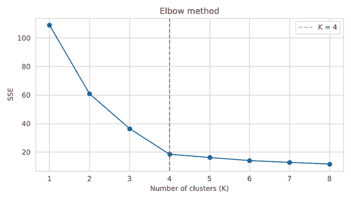
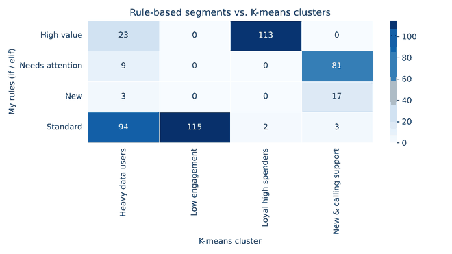

# Customer Segmentation: Rules vs. K-means Clustering

A small learning project from my **Bachelor's in Data Analysis** (in progress).

I work in customer experience, and I usually see customers grouped with simple rules like *"if spend is high → priority customer"*. In this project I compare that approach with **K-means clustering**, where the data finds the groups by itself.

The project combines three topics I studied this week:

| Topic | Where it's used in the project |
|---|---|
| Decision structures in Python (`if / elif / else`) | Rule-based customer segments |
| Data preprocessing & advanced plotting (Matplotlib, Seaborn) | Cleaning, outliers, normalization, subplots, heatmaps |
| Clustering (K-means) | My own K-means implementation + scikit-learn |

> ⚠️ **The dataset is synthetic.** I generated it with `data/generate_data.py` (no real customer data). I added duplicates, missing values, outliers and messy text on purpose to practice cleaning.

## Project structure

```
customer-segmentation-kmeans/
├── data/
│   ├── generate_data.py        # creates the synthetic dataset
│   └── customers_raw.csv       # raw (messy) data
├── notebooks/
│   └── customer_segmentation.ipynb   # main analysis
├── src/
│   └── kmeans_scratch.py       # my K-means written from scratch
├── images/                     # charts used in this README (all charts are in the notebook)
└── requirements.txt
```

## Steps

1. **Cleaning:** removed 10 duplicate rows, fixed inconsistent text (`" Prepaid "`, `"POSTPAID"` …), filled missing values with the median, and found 6 outliers with the IQR method and capped them at the 95th percentile.
2. **EDA:** histograms and a correlation heatmap.
3. **Rule-based segments:** 4 segments with `if / elif / else` (High value, Needs attention, New, Standard).
4. **K-means:** min-max normalization, my own K-means vs scikit-learn, effect of initial centroids, elbow method to choose K = 4.
5. **Comparison:** crosstab heatmap of rules vs clusters.

## Results

**Elbow method:** the SSE improvement becomes small after K = 4



**The 4 clusters K-means found** (scatter plots are in the [notebook](notebooks/customer_segmentation.ipynb))

| Cluster | Avg tenure (months) | Avg spend (SAR) | Avg support calls (6m) | Avg data (GB) | Customers |
|---|---|---|---|---|---|
| Loyal high spenders | 48.4 | 423.8 | 1.0 | 34.9 | 115 |
| Heavy data users | 19.0 | 255.2 | 1.9 | 80.0 | 129 |
| New & calling support | 4.0 | 145.7 | 5.7 | 12.6 | 101 |
| Low engagement | 36.5 | 99.3 | 0.4 | 7.4 | 115 |

**Rules vs. clusters**



## What I found

- My **"High value"** rule matched the *Loyal high spenders* cluster well (113 customers) but also included 23 *Heavy data users*. Spend alone doesn't tell the full story.
- My **"Standard"** rule was one big mixed group (214 customers). K-means split it into *Heavy data users* and *Low engagement* customers. The second group could be a churn risk.
- My **"New"** rule caught only 20 customers, while the *New & calling support* cluster has 101. The reason is the **order of my `elif`s**: most new customers call support a lot, so the "Needs attention" condition caught them first. Only the first true condition runs!
- When I tested my own K-means with 10 random starts, the SSE ranged from **18.45 to 41.62**. The best runs matched scikit-learn exactly, so the choice of initial centroids really matters.

## What I learned

- Clean the data first. The outliers would have pulled the centroids.
- Normalization is necessary before any distance-based algorithm.
- Writing K-means myself helped me understand it much better than just calling `KMeans()`.
- Rules are easy to explain, but they only find what you already expect.

## Next steps

- [ ] Try DBSCAN and hierarchical clustering (K-means assumes round clusters of similar size)
- [ ] Use the silhouette score to choose K
- [ ] Build a small Power BI / Tableau dashboard on top of the segments
- [ ] Try the same analysis on a real public dataset

## How to run

```bash
pip install -r requirements.txt
python data/generate_data.py          # optional: recreate the dataset
jupyter notebook notebooks/customer_segmentation.ipynb
```

---
*Alwaleed Alharbi · Data Analysis student · [LinkedIn](https://www.linkedin.com/in/alwaleed-alharbi-a485b724a)*
